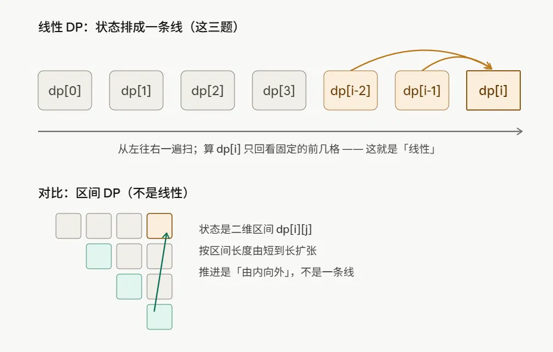

# 线性 DP 一维递推型复习笔记

## 第一步：题型判定

三题都是**线性 DP**，更精确地说是它最入门的亚型——我叫它**一维递推型**。这个细分很重要，因为它决定了你能用什么手段（后面板子库会体现）。

### "线性"到底指什么

关键先纠一个常见误解：**线性 ≠ 时间复杂度 O(n)**。线性指的是**状态（阶段）的排列与推进结构**。

把 DP 想成"填一张表"。线性 DP 这张表是**一维的、能排成一条直线**：`dp[0], dp[1], ..., dp[n]`。这条线上每个格子只依赖它**左边**（下标更小）的格子。于是你从左往右扫一遍就能填完——填到 `dp[i]` 时，它要用的 `dp[i-1]`、`dp[i-2]` 早算好了。这个"沿单一方向推进、一遍扫完"的形态，就是线性。



#### 为什么要专门起这个名？

因为是在和"非线性的推进结构"做区分：

- **区间 DP** `dp[i][j]`：状态是"区间 [i,j]"，依赖的是更短的区间。你没法简单从左扫到右，得**按区间长度从短到长**枚举（先算所有长度 1 的，再长度 2……），推进方向是"由内向外扩张"，是个二维三角形。
- **树形 DP**：状态挂在树节点上，依赖孩子，得按 DFS 后序推进。

所以你说的"input directed"其实想说的是这件事，但表述太模糊了。准确的说法是：**阶段沿输入序列的下标线性排开，推进方向单一**。

### 真正该带走的那一下：枚举"最后一步"

这才是这组题的核心，也是从这三道最简单的题一路能用到困难 DP 的思维。定义 `dp[i]` 时，逼自己问一句：

> **"要到达状态 i，最后一个动作有哪些可能?"**

把这些可能**不重不漏**地列出来，每种都把问题缩小成一个更小的同类子问题——递推式就自己冒出来了。

- **爬楼梯**：站上第 i 阶，最后一步只能"从 i-1 迈 1 步"或"从 i-2 迈 2 步"，两类不重不漏 → `dp[i]=dp[i-1]+dp[i-2]`
- **746**：到达位置 i，上一脚要么在 i-1（花 `cost[i-1]` 跨过来）要么在 i-2，取小
- **Tribonacci**：定义本身就是"由前三项相加"，连决策都没有，是最退化的情形

你之前总结成"斐波那契"只是抓到了表面结论；**"枚举最后一步"才是会迁移的那一层**。

---

## 第二步：特征卡片 + 一句话题解

### 特征卡片 —— 一维递推型线性 DP

**触发条件（看到就想到）：**

求"第 n 项 / 到达第 n 个位置"的方案数、最值或某数值，且**位置 i 的答案只由它前面固定的常数个位置**（i-1, i-2, 至多 i-3）**按一个固定公式决定**，没有复杂决策（或决策只是对这固定几个前驱取 min/max/求和）。

**对应手段：**

设 `dp[i]` = 第 i 项 / 到达 i 的答案 → 枚举"最后一步"写递推 → 定够初值（初值个数 = 回看窗口大小）→ 一遍正推 → **因为只回看固定窗口，用滚动变量把空间压到 O(1)**

**边界易错点：**

1. 初值给够（回看 i-2 要 2 个初值，i-3 要 3 个）
2. 想清 dp 下标含义和"终点"在哪——746 的终点是 `n`（越过最后一级），不是 `n-1`

### 一句话题解

- **70 爬楼梯**：到第 i 阶 = 从 i-1 迈一步 + 从 i-2 迈两步，`dp[i]=dp[i-1]+dp[i-2]`，本质斐波那契
- **746 最小花费**：`dp[i]=min(dp[i-1]+cost[i-1], dp[i-2]+cost[i-2])`，起点 0/1 免费，答案是 `dp[n]`
- **1137 泰波那契**：照定义 `T(n)=T(n-1)+T(n-2)+T(n-3)`，坑在三个初值 `0,1,1`

---

## 第三步：分段手写

按你说的，这三题无掌握难点，**跳过**。

---

## 第四步：板子库

下面是 C++ 版（如果你用 Python / Java，说一声我换一版）。我先给一个**通用骨架**，再给三道题的可直接抄的实现。

### 通用骨架——一维递推、滚动变量、O(1) 空间

```cpp
// 一维递推型线性DP 通用骨架（滚动变量版）
// 适用：dp[i] 只依赖前面固定常数个状态
long long solve(int n) {
    long long a = /*dp[0]*/, b = /*dp[1]*/;   // 初值给够（窗口=2 就 2 个）
    if (n == 0) return a;
    if (n == 1) return b;
    for (int i = 2; i <= n; i++) {
        long long cur = /* f(a, b)，即 dp[i] 的递推式 */;
        a = b; b = cur;                        // 窗口整体右移一格
    }
    return b;
}
```

### 三题实现（均已按 LeetCode 边界验证）

#### 70. 爬楼梯

```cpp
int climbStairs(int n) {
    int a = 1, b = 1;                  // dp[0]=dp[1]=1
    for (int i = 2; i <= n; i++) {
        int cur = a + b;
        a = b; b = cur;
    }
    return b;
}
```

#### 746. 使用最小花费爬楼梯

```cpp
int minCostClimbingStairs(vector<int>& cost) {
    int n = cost.size();
    int a = 0, b = 0;                  // dp[0]=dp[1]=0，起点免费
    for (int i = 2; i <= n; i++) {
        int cur = min(a + cost[i - 2], b + cost[i - 1]);
        a = b; b = cur;
    }
    return b;                          // dp[n]，终点在越过最后一级
}
```

#### 1137. 第 N 个泰波那契数

```cpp
int tribonacci(int n) {
    if (n == 0) return 0;
    if (n <= 2) return 1;              // T(1)=T(2)=1
    long long a = 0, b = 1, c = 1;     // 窗口=3，三个初值
    for (int i = 3; i <= n; i++) {
        long long cur = a + b + c;
        a = b; b = c; c = cur;
    }
    return (int)c;
}
```

### 核心口诀

**回看几格，就留几个滚动变量、给几个初值，每轮整体右移一格。**
